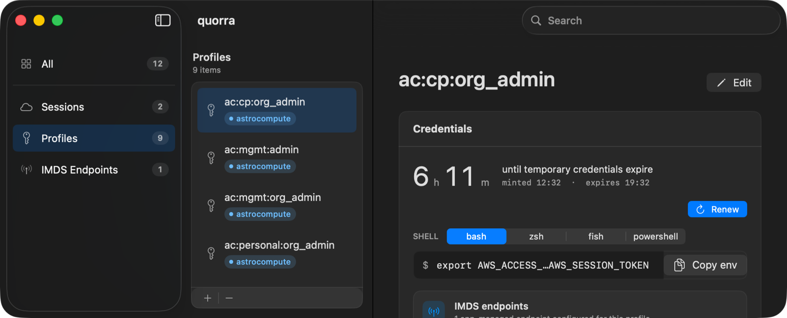
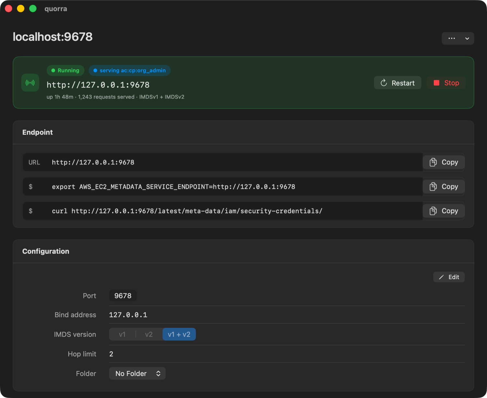

# Quorra

Quorra is a native macOS app for managing AWS IAM Identity Center sessions,
profiles, temporary credentials, and local IMDS endpoints.

It is for developers who move between AWS accounts and roles and want a
visible, local workflow instead of repeatedly running `aws sso login`, editing
`~/.aws/config` by hand, or passing credentials through a collection of shell
scripts. Quorra reads the standard AWS shared configuration, keeps IAM Identity
Center tokens and temporary role credentials in the macOS Keychain, and can
serve a profile through a loopback IMDS endpoint for local AWS tooling.

## Screenshots





## Install

Quorra requires macOS 26 (Tahoe) or later.

1. Download `Quorra.dmg` from the [latest GitHub release](https://github.com/ajbeck/quorra/releases/latest).
2. Open the disk image and move `Quorra.app` to `/Applications`.
3. Open Quorra and grant access to your AWS folder, normally `~/.aws`.
4. Choose **Edit & Manage** to let Quorra update AWS configuration files, or
   **Read Only** to browse profiles and use credentials without changing them.

The first public release is being prepared. Until then, build the app from
source using Xcode 26 or later:

```sh
git clone https://github.com/ajbeck/quorra.git
cd quorra
open Quorra.xcworkspace
```

Run the `quorra` scheme with Command-R.

## What It Does

- Browse AWS IAM Identity Center sessions, profiles, and app-owned IMDS
  endpoints in a three-column macOS interface.
- Sign in with AWS IAM Identity Center through the native device authorization
  flow, refresh sessions, and inspect credential expiry.
- Copy temporary credentials as shell environment variables.
- Manage AWS profile and session configuration in the selected AWS folder.
- Start a local endpoint at `127.0.0.1:<port>` that supports IMDSv2, with IMDSv1
  fallback, so SDKs and tools can use a selected profile without placing
  credentials in their environment.
- Create, stop, inspect, and persist IMDS endpoint definitions independently of
  AWS profile files.
- Keep IAM Identity Center tokens and temporary role credentials in the macOS
  Keychain.

## How Local IMDS Works

Quorra never binds a metadata server to AWS's link-local address. It serves
credentials on `127.0.0.1` and exposes the chosen profile only while its
endpoint is running. Point a compatible client to the local endpoint:

```sh
export AWS_EC2_METADATA_SERVICE_ENDPOINT=http://127.0.0.1:9678
```

The profile detail view can copy this command for a running endpoint. Quorra
also publishes the active port at
`~/Library/Application Support/Quorra/imds.port` for local scripts.

## Data And Permissions

- Quorra asks you to choose the AWS folder it may access. On a normal setup,
  this is `~/.aws`.
- IAM Identity Center tokens and temporary role credentials are stored in the
  macOS Keychain, not in Quorra's application files.
- IMDS endpoints are limited to `127.0.0.1`; they are not exposed on your
  network.
- Read Only mode prevents Quorra from writing to the AWS files you selected.

## Development

The app is built with SwiftUI and targets macOS 26. Run all tests in Xcode with
Command-U. The local `AWSConfigINI` Swift package provides the parser and
atomic writer used for AWS shared-config files.

For release build, signing, notarization, and DMG details, see
[Distribution](docs/Distribution.md). Parser and encoder documentation is in
[AWSConfigINI](docs/AWSConfigINI.html).

## License

Quorra is available under the [Apache License 2.0](LICENSE).

Third-party package notices are in [THIRD_PARTY_NOTICES.md](THIRD_PARTY_NOTICES.md).
